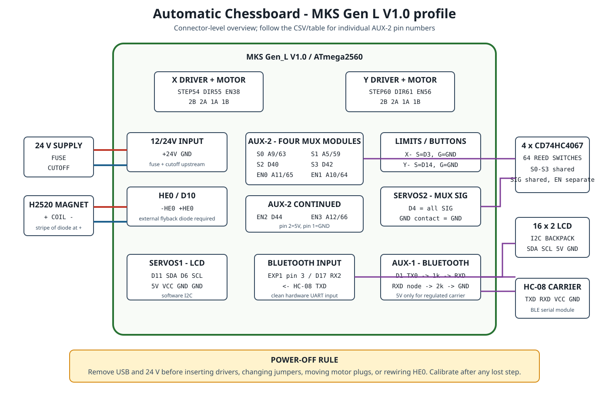

# MKS Gen L V1.0 complete build profile

This is the supported ATmega2560 alternative to the classic Nano controller.
It fits both CoreXY drivers, the 64 reed switches through the existing four
16-channel multiplexers, both calibration/button switches, the 16x2 I2C LCD,
the HC-08 Bluetooth module, and the 24 V electromagnet on one board.

This profile is specifically for the board marked **MKS Gen_L V1.0**. Do not
apply it to an MKS Gen L V2.x or a generic Mega/RAMPS board by appearance.
Connector names and pin numbers below were checked against Makerbase's official
V1.0_008 pin drawing, schematic, and BOM.

## Orientation

Place the board as shown in the official pin drawing: the five driver sockets
form the top row in the order `X Y Z E0 E1`; the `12/24V` input and HE/FAN
outputs are at the left; the colored endstop, servo, AUX, and thermistor headers
are at the right/bottom. Printed `+`, `-`, `S`, `G`, `V`, and pin labels on the
actual board are authoritative.

The machine-readable version of every external connection is
[`mks-gen-l-v1-connections.csv`](mks-gen-l-v1-connections.csv).



## One-page connection map

| Function | MKS connector/contact | Firmware pin | Connect to |
| --- | --- | ---: | --- |
| CoreXY motor `WHITE` | X motor output | X STEP 54, DIR 55, EN 38 | Motor 1 coil pairs |
| CoreXY motor `BLACK` | Y motor output | Y STEP 60, DIR 61, EN 56 | Motor 2 coil pairs |
| Electromagnet | HE0 `+` / `-` | D10 | Magnet `+` / `-`, diode across magnet |
| Switch A / white limit | X- `S` / `G` | D3 | Normally-open switch |
| Switch B / black limit | Y- `S` / `G` | D14 | Normally-open switch |
| MUX shared signal | SERVOS2 D4 / GND | D4 | All four `SIG` pins / ground |
| MUX address `S0-S3` | AUX-2 pins 4,3,6,8 | A9,A5,D40,D42 | All four MUX modules |
| MUX enables `EN0-EN3` | AUX-2 pins 10,5,7,9 | A11,A10,D44,A12 | One enable per MUX |
| MUX power | AUX-2 pin 2 / pin 1 | 5V / GND | All four MUX modules |
| LCD SDA / SCL | SERVOS1 D11 / D6 | D11 / D6 | I2C backpack SDA / SCL |
| LCD power | SERVOS1 5V / GND | 5V / GND | I2C backpack VCC / GND |
| Bluetooth replies | AUX-1 TX / D1 | D1 TX0 | Divider to HC-08 RXD |
| Bluetooth commands | EXP1 pin 3 | D17 RX2 | HC-08 TXD |
| Bluetooth power | AUX-1 5V / GND | 5V / GND | 5V-rated HC-08 carrier |

`WHITE` and `BLACK` are inherited motor identifiers, not wire colors or chess
sides. Never infer a coil pair from wire color. With the motor disconnected,
find the two low-resistance pairs with a meter. One pair occupies `1A/1B`; the
other occupies `2A/2B`. Never unplug a motor while its driver is powered.

## Driver installation and full-step jumpers

1. Remove USB and 24 V. Confirm the X and Y driver sockets are unpowered.
2. Install only X and Y StepStick-compatible carriers, matching `EN`, `STEP`,
   `DIR`, `GND`, and motor-supply orientation to the board labels. A reversed
   carrier can be destroyed immediately.
3. For the release geometry and speed, leave all three X and Y microstep jumper
   positions **open** for full-step operation. If jumper caps are currently
   fitted beneath the sockets, remove them before inserting the drivers.
4. Fit heatsinks without touching header pins. Provide forced air.
5. Set VREF for each particular carrier and motor. The prior prototype values
   are not universal: A4988 and DRV8825 formulas differ, and clone sense
   resistors differ.

The profile drives both onboard enable pins safely: HIGH while STEP/DIR are
initialized, then LOW continuously. That preserves motor holding and the
calibrated CoreXY position.

## Electromagnet on HE0

HE0 already contains a logic-level low-side MOSFET and reset-state gate bias,
so this profile does **not** use the external TIP120, 1 kohm base resistor, or
10 kohm base pull-down.

```text
HE0 +  -> electromagnet +
HE0 -  -> electromagnet -

flyback diode directly across the magnet:
stripe/cathode -> magnet + / HE0 +
plain/anode    -> magnet - / HE0 -
```

The external flyback diode remains mandatory. The board schematic shows only
the output indicator path and MOSFET body diode; neither is a flyback diode
across the load. The documented H2520 is 24 V, 2.8 W (about 117 mA), well below
the normal current of a hot-end output, but verify the actual coil current and
inspect connector/MOSFET temperature during commissioning. The official BOM
identifies the HE outputs' switch part as VS3060AD.

Feed protected 24 V to the board's `12/24V +` and `GND` screw terminal through
the same external fuse, latching hardware cutoff, and reverse-polarity stage as
the Nano design. Leave H-BED, HE1, FAN, Z, E0, and E1 unused. USB can power the
logic for motionless tests, but it cannot power the motors or electromagnet.

## Reed-switch system

The individual glass reed switches do **not** connect directly to 64 Mega
pins. Keep the four existing 16-channel multiplexers:

```text
each reed: one terminal -> its documented C0..C15 channel
           other terminal -> GND

all MUX: S0,S1,S2,S3 shared
         SIG shared
         VCC shared at 5V
         GND shared
         EN separate
```

The square/channel mapping is unchanged: use [`sensor-map.csv`](sensor-map.csv).
MUX0 is a2-h2/a1-h1, MUX1 is a8-h8/a7-h7, MUX2 is a6-h6/a5-h5, and MUX3 is
a4-h4/a3-h3. The unusual order matches the physical prototype and firmware.

AUX-2 is a 2x5 header. Use the pin numbers printed in Makerbase's drawing, not
left/right guesses:

| AUX-2 pin | Signal | Wire to |
| ---: | --- | --- |
| 1 | GND | all MUX GND |
| 2 | 5V | all MUX VCC |
| 3 | A5 / D59 | all S1 |
| 4 | A9 / D63 | all S0 |
| 5 | A10 / D64 | MUX1 EN |
| 6 | D40 | all S2 |
| 7 | D44 | MUX2 EN |
| 8 | D42 | all S3 |
| 9 | A12 / D66 | MUX3 EN |
| 10 | A11 / D65 | MUX0 EN |

SERVOS2 `D4` receives all four MUX `SIG` pins; use the GND contact in that same
three-pin group. Do not use TH1, TH2, or TB for sensor data. Makerbase fits each
thermistor input with a 4.7 kohm / 10 uF low-pass filter, which is intentionally
slow for temperature measurement and incompatible with a rapid 64-channel scan.

On the official drawing the two adjacent three-pin groups are:

```text
SERVOS2: D4  5V  GND   <- shared MUX SIG uses D4 and GND
          D5  5V  GND
SERVOS1: D6  5V  GND   <- LCD SCL uses D6
         D11  5V  GND  <- LCD SDA uses D11; LCD power may use this row
```

## LCD and Bluetooth

The V1.0 board does not expose ATmega2560 hardware SDA/SCL on a connector.
Firmware therefore runs the existing PCF8574/MCP23008 LCD backpack on a
software-I2C bus:

```text
SERVOS1 D11 -> LCD SDA
SERVOS1 D6  -> LCD SCL
SERVOS1 5V  -> LCD VCC
SERVOS1 GND -> LCD GND
```

Bluetooth is full duplex and independent of USB receive:

```text
HC-08 TXD ------------------------> EXP1 pin 3 (D17 / RX2)

AUX-1 TX (D1) -> 1 kohm ->+------> HC-08 RXD
                           |
                         2 kohm
                           |
                          GND

AUX-1 5V/GND -> HC-08 carrier VCC/GND
```

The divider keeps the HC-08 RX input near 3.3 V. Direct HC-08 TXD to D17 is
correct: a 3.3 V output is a valid HIGH for this 5 V AVR input. Supply 5 V only
to a carrier board with its own regulator; a bare radio module requires 3.3 V.

EXP1 numbering follows the keyed 2x5 connector: pin 1 is `D37`, pin 2 is `D35`,
pin 3 is `D17`, and pin 10 is `5V`. Use only pin 3 for HC-08 TXD; do not rotate
an IDC plug or feed 5 V into the radio TX output.

## Build and upload

Install pinned dependencies and compile both profiles:

```powershell
./firmware/test.ps1 -InstallDependencies
```

With 24 V physically disconnected, upload the MKS image explicitly:

```powershell
./firmware/build.ps1 -HardwareProfile mks-gen-l-v1 -Upload -Port COM11
```

The build reports `MKS_GEN_L_V1` in `INFO`; a generic Mega compile is not a
substitute. Nano remains the default build when `-HardwareProfile` is omitted.

## Safe commissioning order

1. **Bare board, USB only:** no drivers, motors, magnet, MUX, LCD, or Bluetooth.
   Upload the MKS profile and run the motionless serial probe. `TELEM` must show
   magnet `0`; `INFO` must include `MKS_GEN_L_V1`.
2. **Logic loads, USB only:** connect LCD, MUX modules, reeds, switches, and
   Bluetooth. Confirm the LCD, `BOARD`, Bluetooth, and `SWTEST`. Validate all 64
   squares with one piece magnet. No 24 V yet.
3. **Drivers fitted, 24 V off:** verify carrier orientation, full-step jumper
   state, coil pairs, VREF, heatsinks, fan, flyback diode, fuse, and cutoff.
4. **One motor at a time, magnet disconnected:** enable protected 24 V and use
   only `JOG W+/-`, then only `JOG B+/-`. Keep a hand on the hardware cutoff.
   Correct direction by reversing one complete coil pair, never by mixing pairs.
5. **CoreXY without pieces/magnet:** connect both motors, calibrate, run straight
   horizontal/vertical head moves at the release speed, and check for collision,
   resonance, step loss, belt slip, and driver temperature.
6. **Magnet only:** disconnect motors or remove their VMOT path; connect the
   electromagnet and prove off-state, short pulse, release, 30-second firmware
   cutoff, diode orientation, and MOSFET/connector temperature.
7. **Integrated board:** reconnect motion and magnet, calibrate, verify e6 at
   calibration completion, test app/USB/Bluetooth head moves, then test one
   carried piece before a populated board.

After any collision, missed step, driver reset, motor disconnect, emergency
cutoff, or manual carriage movement, calibration is mandatory. USB/Bluetooth
`!` is best effort; the external hardware cutoff remains the real safety stop.

## Official board references

- [Makerbase MKS Gen L repository](https://github.com/makerbase-mks/MKS-GEN_L)
- [Official V1 pin drawing](https://github.com/makerbase-mks/MKS-GEN_L/blob/master/hardware/MKS%20Gen_L%20V1.0_008/MKS%20Gen_L%20V1.0_008%20PIN.pdf)
- [Official V1 schematic](https://github.com/makerbase-mks/MKS-GEN_L/blob/master/hardware/MKS%20Gen_L%20V1.0_008/MKS%20Gen_L%20V1.0_008%20SCH.pdf)
- [Official V1 BOM](https://github.com/makerbase-mks/MKS-GEN_L/blob/master/hardware/MKS%20Gen_L%20V1.0_008/MKS%20Gen_L%20V1.0_008%20BOM.pdf)
