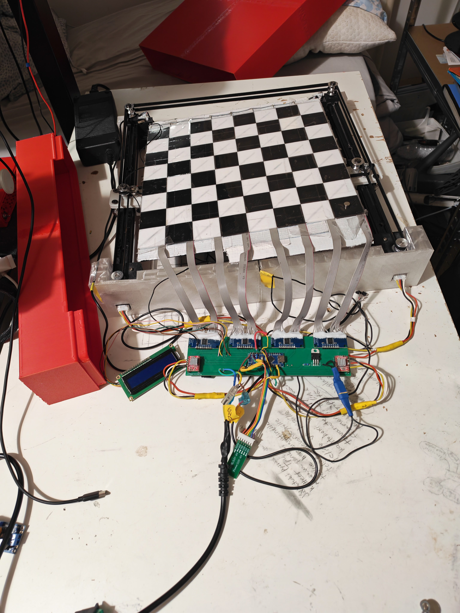
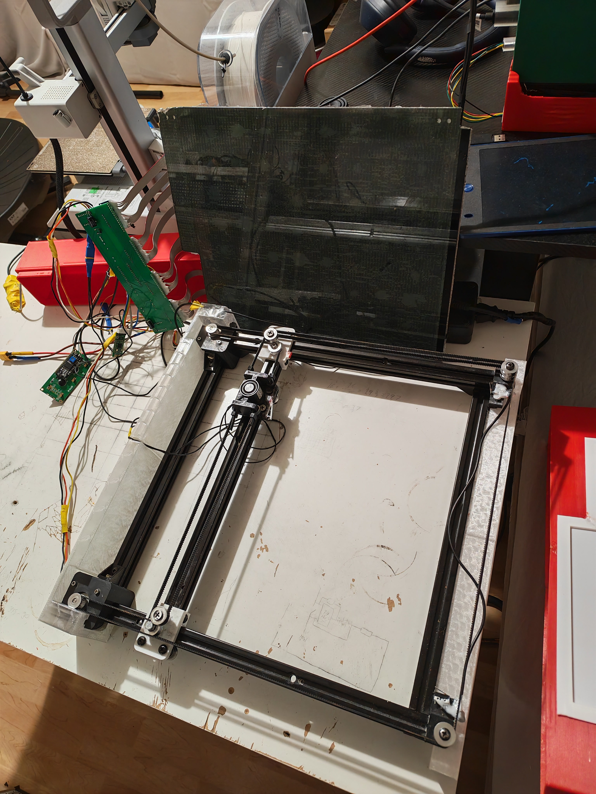
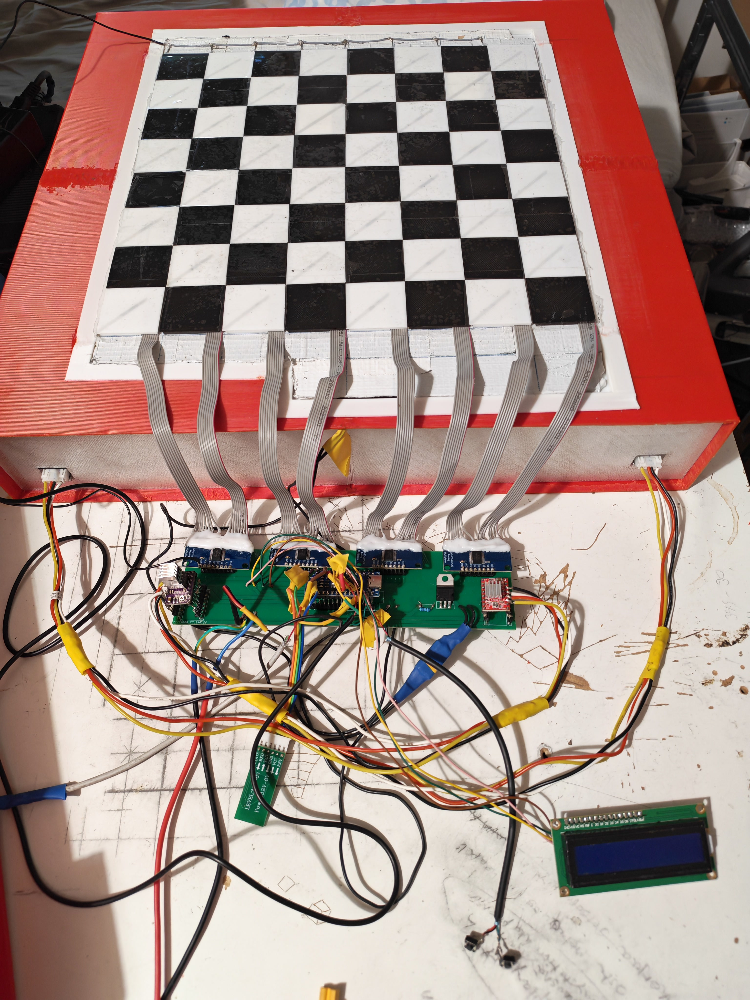
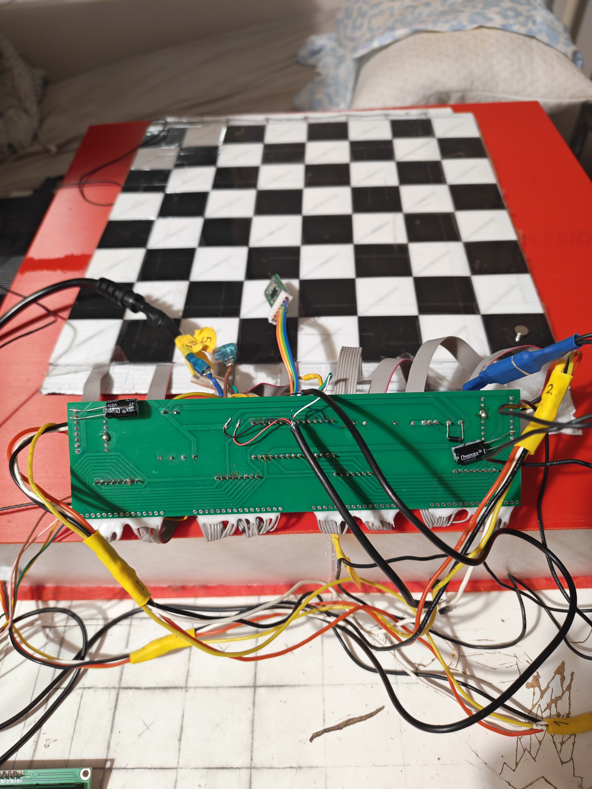

# Working prototype reference

These photographs show the current working machine during enclosure and wiring
development. The mechanism, sensor board, controller PCB, Bluetooth link, LCD,
and electromagnet operate; exposed wiring and open covers in these views are
service-access states, not a recommended finished enclosure.

The photographs were supplied by project author Roni Tervo in 2026 and are
covered by the repository's [CC BY-NC-SA 4.0 license](../LICENSE.md). The
repository copies were exported at their original pixel dimensions with
location and device metadata removed; the source photographs were not changed.

## Overall arrangement

The complete motion mechanism forms an internal body, or chassis, that slides
into the outer case from the front. This keeps the mechanism removable for
belt, wheel, magnet, sensor, and controller service instead of permanently
trapping it inside the enclosure.

Four project-authored TPU spacers attach to the front and rear of the internal
body. They are functional parts rather than cosmetic trim:

- they center the body inside the case;
- restrain side-to-side and vertical movement;
- add support between the chassis and enclosure; and
- reduce transmitted vibration and rattling.

The spacers should provide light, even restraint without requiring force to
insert or remove the chassis. Recheck the fit after the TPU has been compressed
for several days, and keep cables clear of every sliding contact surface.

## Board support and pickup distance

The prototype's 2.2 mm printed tiles are glued to a repurposed 3D-printer glass
door, with the reed switches supported in the tile pockets. The glass is about
the same thickness as the enclosure's 2.4 mm top skin. Placing this complete
glass-and-tile assembly on top of an unmodified enclosure would add the top
skin to the magnetic path and make the H2520 electromagnet too weak for
reliable pickup.

The prototype therefore uses a large opening cut in the printed case top. The
glass is lowered into that opening and supported solidly around it, so the case
top and glass do not form two stacked structural layers below the playing
surface.

Two top constructions are supported by this design:

1. **Recessed glass board:** cut an opening in the printed case, provide a
   level ledge or distributed supports, and retain the glass against sliding or
   lifting. Protect every glass edge and do not drill, trim, or point-load a
   glass plate whose tempering and machining limits are unknown.
2. **Tiles directly on the case:** attach the tiles and their supported sensor
   harness directly to the case top. The top skin then replaces the glass in
   the magnetic path, so no large opening is required.

Either construction must remain flat, keep every reed switch protected, and
hold a consistent distance between the carriage electromagnet and all 32 piece
magnets. Validate every finished piece on every square before closing the case;
nominal layer thickness alone cannot prove reliable sensing or pickup.

## Tested enclosure print

The supplied enclosure STL was printed with a 0.8 mm nozzle and three
perimeters. The slicer limited extrusion width to about 0.82 mm, producing a
nominal 2.4 mm wall, top, and floor around the case. These are tested prototype
settings, not mandatory slicer requirements. A different nozzle, wall count,
material, or infill is acceptable if the result remains flat, supports the
board safely, retains the sliding chassis, and leaves the mechanism serviceable.

Additional cosmetic covers may hide the controller and wiring, but they must
not obstruct the physical cutoff, ventilation, USB access, fuses, driver
adjusters, removable connectors, or the front removal path.

### Finishing the enclosure

The next enclosure iteration can look cleaner without sacrificing the current
service access. Prefer removable screwed or clipped panels over permanently
glued covers, and include:

- a guarded controller bay that prevents fingers or loose chess pieces from
  reaching exposed terminals;
- cable guides and strain relief for the eight sensor ribbons, motor leads,
  magnet lead, display, switches, and Bluetooth module;
- direct access to the cutoff, fuse holders, USB connector, display, and player
  controls;
- ventilation around the buck converter, motor drivers, and their heatsinks;
  and
- keyed connectors or sufficient service loops so the internal body can slide
  out without cutting or desoldering wires.

Before accepting a new cover, repeat full carriage travel by hand and confirm
that no panel, fastener, cable, or service loop enters the belt or trolley
envelope.

## Working PCB and external rework

The fabricated long controller PCB is functional and is used by the working
prototype. Its archived KiCad design predates several current connections, so
the assembled board works only with external wires and resistors that implement
the current [wiring contract](WIRING.md):

- do not use the legacy D10 switch connector for the second switch;
- connect HC-08 `TXD` through 1 kohm to Nano `D10`;
- move the second normally-open switch to Nano `A6`, with the other switch
  terminal at GND and a 10 kohm pull-up from `A6` to 5 V;
- connect Nano `D1/TX` through 1 kohm to HC-08 `RXD`, with 2 kohm from that
  divider node to GND; and
- add every other external connection required by
  [`connections.csv`](connections.csv), rather than assuming an unrouted PCB
  net is optional.

This proves that an existing fabricated board can be reused and repaired. It
does not turn the historical KiCad files into a fabrication release: they do
not contain all current routing, protection, Bluetooth, A6, or verified
manufacturing details. See the
[`legacy-controller` notice](reference/legacy-controller/README.md) before
working on one.
