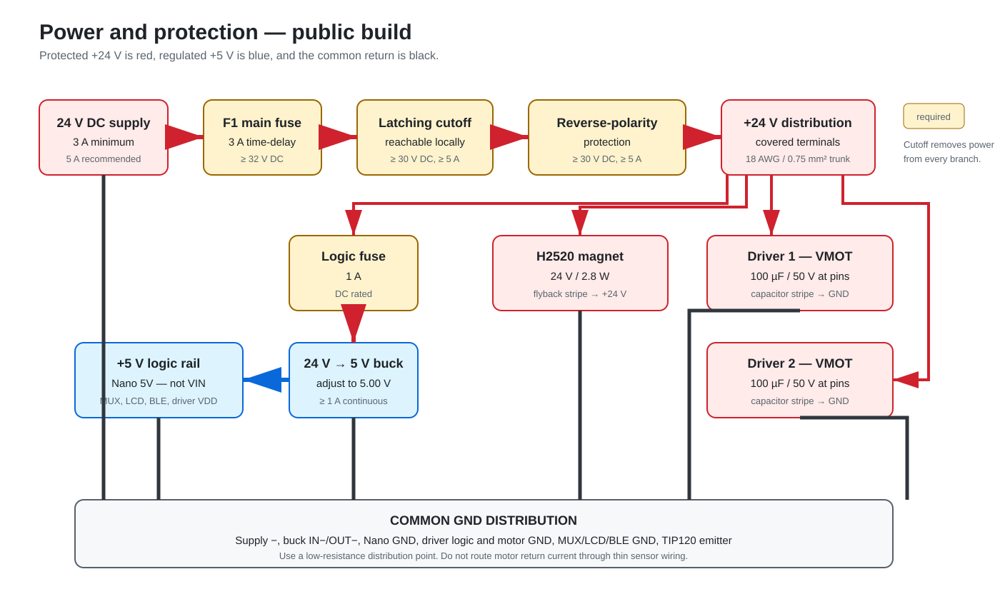
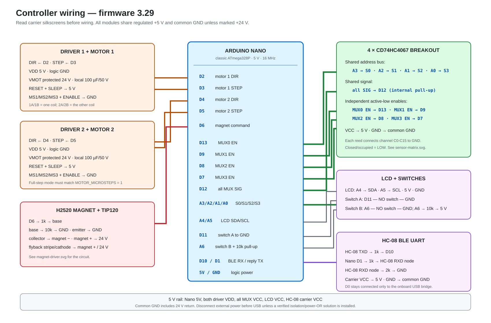
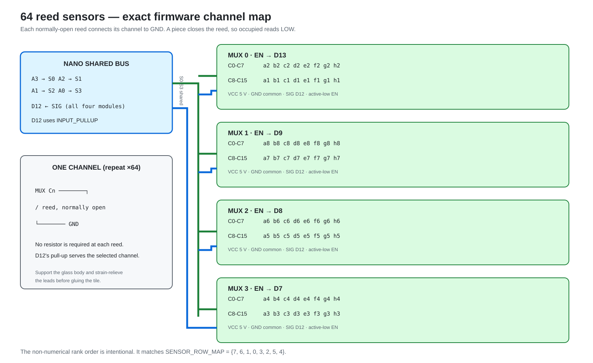

# Hardware build guide

This folder is the electrical build contract for firmware **3.29**. It is
intended to be detailed enough for a school lab or first-time builder without
pretending that the prototype PCB is a manufacturing-ready product.

Start with these documents, in order:

1. [Safety rules](SAFETY.md)
2. [Bill of materials](BOM.md)
3. [Wiring and pin contract](WIRING.md)
4. [Mechanical interface](MECHANICAL.md)
5. [Working prototype and enclosure reference](PROTOTYPE.md)
6. [Staged assembly](ASSEMBLY.md)
7. [First-power commissioning](COMMISSIONING.md)

The [`printFiles`](printFiles/README.md) directory contains the project's 3D
print models, separately attributed third-party models, and optional printable
20 x 20 mm V-slot components for builders evaluating an alternative to
aluminium extrusions and brackets.

This hardware is a modified 24 V implementation of Greg06's
[Automated Chessboard](https://www.instructables.com/Automated-Chessboard/),
rebuilt around salvaged 3D-printer motion parts. The base project is credited
in the repository's [attribution notice](../ATTRIBUTION.md); its CC BY-NC-SA
license and this repository's license exceptions are mapped in
[`LICENSE.md`](../LICENSE.md).

The machine-readable sources of truth are [connections.csv](connections.csv)
and [sensor-map.csv](sensor-map.csv). Run `./hardware/validate.ps1` from the
repository root after changing hardware pins, firmware pins, or the sensor map.

## What is authoritative

| Artifact | Status | Use |
| --- | --- | --- |
| `WIRING.md`, diagrams, and CSV tables | Current | Build firmware 3.29 hardware from these |
| Firmware constants in `global.h` | Current | Pin and motion configuration |
| Commissioning checklist | Current | Required before first movement |
| [Photographed working build](PROTOTYPE.md) | Tested prototype | Evidence for the mechanism, enclosure integration, controller rework, component choices, and 0.720 V driver setting |
| `reference/legacy-controller` | Working fabricated prototype with historical design files | Reuse an existing board only with the documented external rework; do not treat it as a current fabrication release |

The fabricated legacy PCB operates in the photographed prototype after adding
external wiring and resistors. Do **not** send its archived design to a
manufacturer unchanged: it predates the current Bluetooth and A6 changes and
intentionally leaves required wiring out of the PCB design. No Gerbers are
published.

## System at a glance

## Tested prototype versus public build

The existing prototype proves the electrical and firmware arrangement, but it
does not yet contain every protection required by this guide.

| Item | Existing prototype | Public build requirement |
| --- | --- | --- |
| 24 V supply | Unbranded 24 V, 10 A brick | Regulated, enclosed supply; 3 A minimum, 5 A recommended |
| Main fuse | Not installed | 3 A time-delay starting value, at least 32 V DC, close to inlet; 5 A maximum only after measuring load |
| Emergency cutoff | PSU rocker switch | Latching, reachable switch rated for at least 30 V DC and 5 A |
| Reverse polarity | Not installed | 30 V-or-higher, 5 A-or-higher protection module or equivalent |
| Logic power | 5 V buck currently connected to Nano `VIN` | Regulated 5.0 V connected to Nano `5V` |
| Driver wake | `RESET` and `SLEEP` tied together; no external 5 V trace | Tie both together and explicitly connect them to 5 V |
| Driver surge capacitor | 100 uF, 50 V at each carrier | Same, mounted directly across each `VMOT`/`GND` pair |

The protections are not cosmetic. A 10 A supply can deliver far more fault
current than the thin wires and modules can survive. The fuse protects wiring;
the cutoff gives the operator a dependable local stop. Bluetooth, software,
limit switches, and the Nano are not emergency-stop devices.

## Known measurements from the working board

- Board: 300 x 300 mm; each square: 37.5 x 37.5 mm.
- Reed-to-piece gap: approximately 0.2 mm in the printed tiles.
- Drivers: red StepStick-compatible carriers marked `HR4988SQ`, with two
  `R100` (0.10 ohm) sense resistors and heatsinks.
- Driver reference voltage: 0.720 V from potentiometer metal to driver GND.
  For this exact `R100` carrier, `0.720 / (8 x 0.10) = 0.90 A` peak limit.
- Driver mode: full step; `MS1`, `MS2`, and `MS3` low/open.
- Motor supply capacitors: 100 uF, 50 V electrolytic, one per driver.
- Electromagnet: H2520, 24 V, 2.8 W (about 117 mA nominal).

The JGAurora A3S donor motors no longer have labels, and no reliable
manufacturer phase-current specification was found. Treat 0.720 V as a tested
prototype setting, not a value to copy onto a different driver or motor.

## Design boundary

This documentation defines the low-voltage electronics and the mechanical
interfaces expected by the firmware. It does not define a certified product,
mains-voltage wiring, a sellable PCB, or a production enclosure. Builders may
change the frame, rails, belts, tiles, and capture bin if the electrical pin
contract, 37.5 mm square pitch, homing behavior, and motion calibration remain
consistent.
