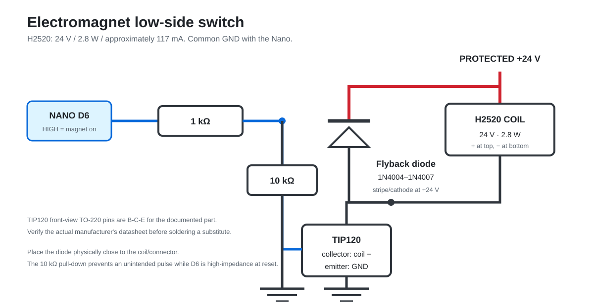

# Wiring and firmware pin contract

This page is the human-readable source of truth. The same point-to-point data
is in `connections.csv` and `sensor-map.csv`.

## Nano pins

| Nano pin | Function | Connect to | Electrical behavior |
| --- | --- | --- | --- |
| D0/RX | USB serial receive | Onboard USB bridge only | Do not connect HC-08 TX here |
| D1/TX | Shared reply transmit | 1 kohm then HC-08 RXD node; 2 kohm from node to GND | Divider produces about 3.3 V |
| D2 | Motor 1 direction | Driver 1 `DIR`; separate 10 kohm from `DIR` to logic GND | Firmware name `MOTOR_WHITE_DIR`; defaults LOW during reset |
| D3 | Motor 1 step | Driver 1 `STEP`; separate 10 kohm from `STEP` to logic GND | Firmware name `MOTOR_WHITE_STEP`; defaults LOW during reset |
| D4 | Motor 2 direction | Driver 2 `DIR`; separate 10 kohm from `DIR` to logic GND | Firmware name `MOTOR_BLACK_DIR`; defaults LOW during reset |
| D5 | Motor 2 step | Driver 2 `STEP`; separate 10 kohm from `STEP` to logic GND | Firmware name `MOTOR_BLACK_STEP`; defaults LOW during reset |
| D6 | Electromagnet control | 1 kohm to TIP120 base | HIGH energizes magnet |
| D7 | MUX 3 enable | MUX 3 `EN` | Active LOW |
| D8 | MUX 2 enable | MUX 2 `EN` | Active LOW |
| D9 | MUX 1 enable | MUX 1 `EN` | Active LOW |
| D10 | Bluetooth receive | HC-08 TXD through 1 kohm | Receive-only software UART |
| D11 | Button/limit A | Normally-open switch to GND | Internal pull-up; pressed is LOW |
| D12 | Shared sensor input | All four MUX `SIG` pins | Internal pull-up; occupied is LOW |
| D13 | MUX 0 enable | MUX 0 `EN` | Active LOW; onboard LED may blink during scans |
| A0 | MUX address bit 3 | All MUX `S3` pins | Shared address bus |
| A1 | MUX address bit 2 | All MUX `S2` pins | Shared address bus |
| A2 | MUX address bit 1 | All MUX `S1` pins | Shared address bus |
| A3 | MUX address bit 0 | All MUX `S0` pins | Shared address bus |
| A4 | I2C data | LCD `SDA` | 5 V I2C bus |
| A5 | I2C clock | LCD `SCL` | 5 V I2C bus |
| A6 | Button/limit B | Normally-open switch to GND, plus 10 kohm to 5 V | Analog-only input; pressed is LOW |
| 5V | Logic rail | Buck 5.0 V, drivers `VDD`, MUX `VCC`, LCD VCC, HC-08 carrier VCC | Do not use VIN for a 5 V buck |
| GND | Common reference | Every 5 V and 24 V subsystem ground | Use a low-resistance distribution point |
| VIN | Unused | Nothing in this design | Classic Nano VIN expects 7-12 V |

The motor names `WHITE` and `BLACK` are inherited firmware identifiers. They
do not define motor wire colors or a universal left/right mounting position.
Verify each axis in the guarded service test before calibration.

## Power tree

Wire the positive path in this order:

```text
24 V supply + -> F1 3 A time-delay -> latching cutoff -> reverse-polarity stage -> +24V_BUS
24 V supply - ---------------------------------------------------------------> GND_BUS

+24V_BUS -> driver 1 VMOT
+24V_BUS -> driver 2 VMOT
+24V_BUS -> electromagnet positive
+24V_BUS -> logic-fused buck IN+
GND_BUS  -> both driver motor GND pins, TIP120 emitter, buck IN-, and all logic GND

buck OUT+ (adjusted to 5.00 V) -> Nano 5V and 5V logic rail
buck OUT- ---------------------> GND_BUS
```

Mount a 100 uF/50 V capacitor directly at each driver: capacitor `+` to
`VMOT`, striped `-` lead to the adjacent motor `GND`. Long wires before the
capacitor do not replace local decoupling.

## Stepper drivers

For each StepStick-compatible carrier:

| Driver pin | Connection |
| --- | --- |
| `VMOT` | Protected +24 V bus |
| Motor `GND` beside VMOT | Common GND and capacitor negative |
| `VDD` | Regulated 5 V |
| Logic `GND` beside VDD | Common GND |
| `RESET` and `SLEEP` | Tie together, then connect to 5 V |
| `MS1`, `MS2`, `MS3` | GND for explicit full-step operation |
| `ENABLE` | GND for explicit enabled operation |
| `STEP`, `DIR` | Nano pins listed above; each input also has its own 10 kohm pull-down to logic GND |
| `1A`, `1B` | The two wires of motor coil A |
| `2A`, `2B` | The two wires of motor coil B |

Carrier labels, not board color or component-side orientation, are
authoritative. With all power removed and the motor disconnected, use a meter
to find the two low-resistance wire pairs. One pair goes to `1A/1B`; the other
goes to `2A/2B`. Swapping both wires of one coil reverses that motor. Never mix
one wire from each coil into a pair.

An early prototype left `MS1-3` and `ENABLE` open and could appear to work
because its carriers provided low defaults. Do not copy that wiring. Connect
these pins explicitly as shown above so correct operation does not depend on
weak internal bias resistors or an undocumented clone-board implementation.

Install four independent 10 kohm pull-downs: one from each driver's `STEP` and
`DIR` input to that carrier's logic GND. Place them near the carrier inputs;
they are shunt resistors, not series resistors, and `STEP` and `DIR` must not
share one resistor. A driven 5 V HIGH sources only 0.5 mA through each
pull-down. The working prototype uses all four resistors, which keep the
otherwise floating A4988-compatible inputs LOW while the Nano starts or resets.

### Motor wiring layout and interference control

Stepper outputs switch substantial current at high frequency. A driver can be
electrically correct on the bench yet lose holding torque or stop after it is
installed beside long, parallel power and signal wiring. Treat physical cable
routing as part of the circuit:

- Twist `1A` with `1B` as one motor-coil pair and twist `2A` with `2B` as a
  second pair. Do not twist one conductor from each coil together.
- Run `STEP` beside a logic-GND return and `DIR` beside a logic-GND return.
  Keep both routes short and keep their pull-down resistors at the carrier.
- Twist each fan's positive and negative supply wires together. Route fan,
  motor, electromagnet, and 24 V wiring separately from Nano, Bluetooth,
  switch, reed-sensor, `STEP`, and `DIR` wiring.
- Maximize separation between switched-power and logic bundles. There is no
  universal minimum distance; validate the final enclosure layout. If bundles
  must cross, cross once at approximately 90 degrees rather than running them
  parallel.
- Give each driver a short, low-resistance ground path to the common
  distribution point. Do not make logic current return through a long motor or
  fan ground wire. Keep the local `VMOT` capacitor at the carrier.
- Add strain relief so installing a cover or moving a harness cannot bend a
  connector, pull a crimp, or change a solder joint.

Never add pull-down resistors to `1A`, `1B`, `2A`, or `2B`. They are driven
H-bridge outputs, not floating logic inputs. Never connect a motor-output wire
to logic GND, chassis, or cable shield. If shielded signal cable is required
after routing has been corrected, terminate its shield at the controller end
only and keep the shield isolated from every signal and motor conductor.

Human proximity changing motor behavior is not normal. First verify the local
`STEP`/`DIR` pull-downs and explicit control-pin levels, then separate cable
groups. If repositioning a whole group fixes the fault, repeat the test with
one group at a time. A failure that follows distance from another bundle points
to coupled interference; a failure that follows bending or tension points to
an open conductor, connector, solder joint, or PCB trace. Use a nonconductive
temporary fixture for diagnosis, then replace it with secured plastic
standoffs, clips, or a printed bracket. Paper or cardboard is not a permanent
electronics mount.

### Current limit

The photographed HR4988SQ boards contain two `R100` resistors, so:

```text
I_limit = VREF / (8 x 0.10 ohm)
VREF = 0.8 x desired current in amperes
```

| VREF | Approximate limit on this R100 carrier |
| ---: | ---: |
| 0.40 V | 0.50 A |
| 0.48 V | 0.60 A |
| 0.56 V | 0.70 A |
| 0.64 V | 0.80 A |
| 0.72 V | 0.90 A (tested prototype setting) |

Use the motor's rated phase current when known. If it is unknown, start lower,
test unloaded motion, and increase only enough to avoid missed steps while
watching temperature. Recalculate the table if the sense resistors are not
`R100` or the carrier documentation specifies a different relationship.

## Electromagnet driver



- H2520 positive -> protected +24 V.
- H2520 negative -> TIP120 collector (middle lead on the documented TO-220
  part when viewed from the marked front).
- TIP120 emitter -> GND.
- Nano D6 -> 1 kohm -> TIP120 base.
- 10 kohm from TIP120 base to GND keeps the magnet off during reset.
- Flyback diode directly across the magnet: **stripe/cathode to +24 V**,
  unstriped/anode to the collector/magnet-negative node.

The 24 V / 2.8 W magnet draws about 117 mA nominal. The diode is mandatory even
at this modest current because the coil produces a voltage spike when switched
off.

## LCD, buttons, and Bluetooth

```text
LCD:   GND -> GND, VCC -> 5V, SDA -> A4, SCL -> A5

SW A:  D11 ---- normally-open switch ---- GND
SW B:  A6  ---- normally-open switch ---- GND
       A6  ---- 10 kohm ----------------- 5V

HC-08 TXD ---- 1 kohm ---- D10

Nano D1/TX --- 1 kohm ---+--- HC-08 RXD
                          +--- 2 kohm --- GND

HC-08 carrier VCC -> 5V
HC-08 GND         -> GND
```

The 5 V connection is for an HC-08 **carrier with an onboard regulator**, as
used in the prototype. A bare 3.3 V module must not be powered from 5 V. Keep
the D1 divider even when the carrier accepts a 5 V supply; supply tolerance
does not prove that its RX logic input is 5 V tolerant.

## Reed sensors and multiplexers

All four modules share `S0-S3`, `SIG`, 5 V, and GND. Each module has its own
active-low `EN` pin. Each normally-open reed switch connects between one `C0`
through `C15` channel and GND. A nearby piece magnet closes the switch and the
firmware reads LOW.

The exact 64-square channel assignment is in `sensor-map.csv` and shown in the
sensor diagram. Viewed by logical chess coordinates:

| MUX | EN pin | C0-C7 | C8-C15 |
| ---: | --- | --- | --- |
| 0 | D13 | a2-h2 | a1-h1 |
| 1 | D9 | a8-h8 | a7-h7 |
| 2 | D8 | a6-h6 | a5-h5 |
| 3 | D7 | a4-h4 | a3-h3 |

This unusual rank order is deliberate and matches the glued-tile prototype
and firmware `SENSOR_ROW_MAP`. Do not silently rearrange it into numerical
rank order.
